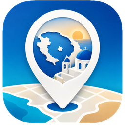

<p align="center">
  
</p>

<h1 align="center">Échappée à Santorin</h1>

<p align="center">
  <em>Mon carnet de l'île, à portée de pouce — plages, tavernes, supermarchés et
  trésors des Cyclades, prêts à me guider tout l'été.</em>
</p>

Carte personnelle des lieux d'intérêt de Santorin (plages, supermarchés,
restaurants, laveries, sites culturels, services), conçue pour un usage au
quotidien pendant les vacances. L'application affiche chaque lieu sur une carte
et permet d'envoyer ses coordonnées GPS vers **Apple Plans**, **Google Maps** ou
**Waze** en un tap.

C'est une **PWA** (application web installable) : pas besoin de l'App Store ni
d'un compte développeur Apple. On l'ouvre dans Safari sur l'iPhone, on l'ajoute
à l'écran d'accueil, et elle se comporte comme une app native — y compris hors
ligne une fois ouverte une première fois.

## Ma location (Maison)

Le premier bouton du sélecteur, **🏠 Maison**, pointe vers ton logement. Les
coordonnées se saisissent dans la page **Configuration** (bouton ⚙️ en haut à
droite) : à la main, ou via **« Utiliser ma position actuelle »** (GPS du
téléphone, pratique une fois sur place). La location est stockée sur l'appareil
(`localStorage`), donc conservée hors ligne et jamais transmise. Un tap sur le
bouton Maison centre la carte dessus et ouvre l'itinéraire Apple/Google/Waze ;
tant qu'aucune location n'est définie, il ouvre directement la configuration.

## Pile technique

- **Vite** + **TypeScript** (aucun framework UI, DOM natif)
- **Leaflet** + tuiles raster **OpenStreetMap** (mises en cache au fil de la
  navigation pour rester disponibles hors ligne)
- **vite-plugin-pwa** (Workbox) pour le service worker et le manifeste

## Structure

```
data/        Corpus source (GeoJSON + KML)
docs/        Guides pratiques de Santorin
assets/      Source de l'icône (icon-source.png) + image README
scripts/     Génération du seed et des icônes
src/
  data/      Modèle POI, chargement, catégories
  map/       Création de la carte, fond de carte, marqueurs
  ui/        Barre de filtres, fiche détail, liste
  lib/       Liens profonds de navigation (Apple/Google/Waze)
  styles/    Tokens et styles globaux
public/      Artefacts générés (pois.json, icônes) — non versionnés
```

## Démarrage

```bash
npm install
npm run seed     # data/*.geojson -> public/data/pois.json
npm run icons    # assets/icon-source.png -> public/icons/*
npm run dev      # serveur de dev
```

`npm run seed` et `npm run icons` ne sont à relancer qu'après modification du
corpus ou de l'icône.

## Build de production

```bash
npm run build     # vérifie les types puis produit dist/
npm run preview   # sert dist/ localement
```

## Déploiement (GitHub Pages)

L'app est hébergée sur GitHub Pages à l'adresse **https://jeanjerome.github.io/santorin/**.

Le déploiement est automatique via GitHub Actions (`.github/workflows/deploy.yml`) :
chaque `git push` sur `main` régénère le seed et les icônes, build le projet et
publie `dist/` sur Pages. Aucune étape manuelle.

> Le site est servi sous le sous-chemin `/santorin/` : c'est pourquoi `base` est
> fixé à `/santorin/` dans `vite.config.ts` et les `fetch` runtime utilisent
> `import.meta.env.BASE_URL`. Si le repo est renommé, mettre ces deux valeurs à
> jour.

## Installation sur iPhone

1. Ouvrir **https://jeanjerome.github.io/santorin/** dans **Safari**.
2. Bouton Partager → **Sur l'écran d'accueil**.
3. Lancer l'app depuis l'icône. Après la première ouverture, carte et données
   fonctionnent hors ligne (le HTTPS de Pages active le service worker).

## Données

Le corpus (`data/santorini-corpus-restreint.geojson`) contient 30 lieux, dont 16
géolocalisés. Les lieux sans coordonnées restent visibles dans la liste avec un
badge « Sans GPS » et proposent une recherche par nom dans l'app de navigation.
Pour ajouter ou corriger un lieu, éditer le GeoJSON puis relancer `npm run seed`.
